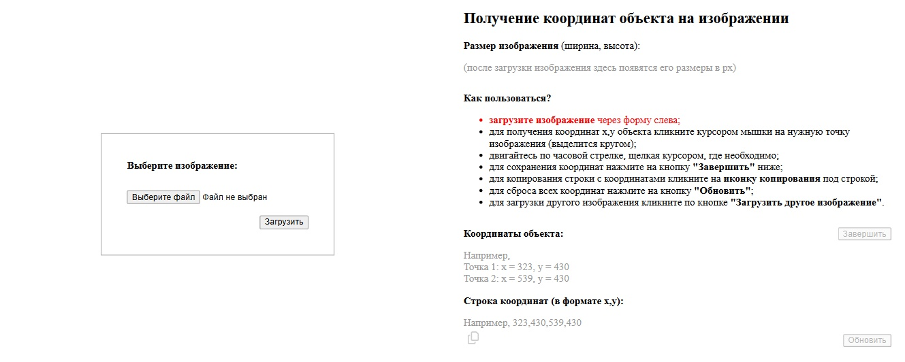
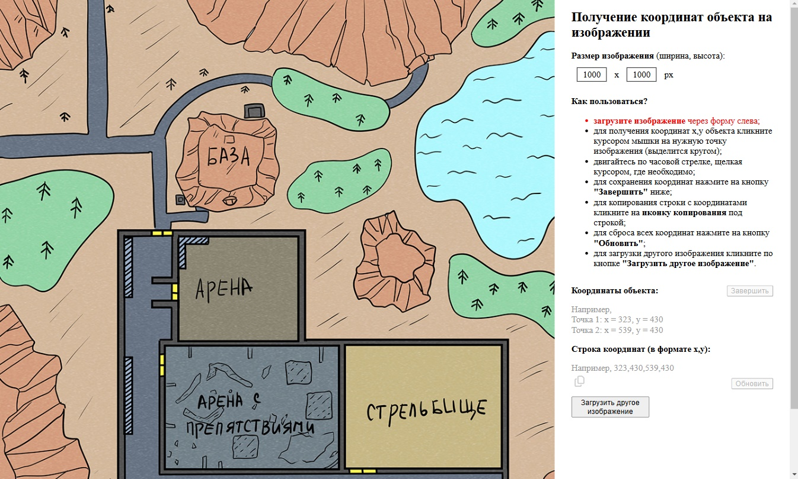
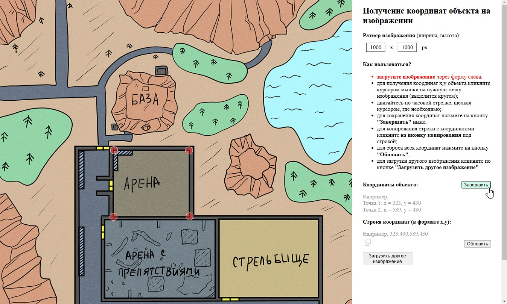
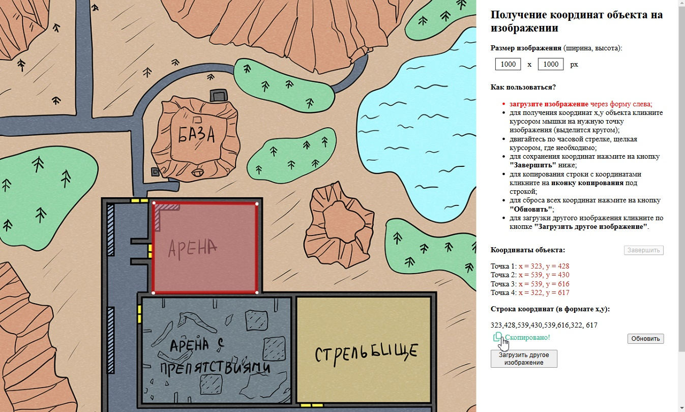

# Get Coordinates Application (HTML | CSS | JS)

## О проекте
Приложение позволяет получить координаты точек при клике на изображение (в виде упорядоченного списка и строки) и выделить по ним полигон.

**Инструменты:** 

**Языки:** 
 
 
 

**Демо:** [Перейти на сайт](https://the-all-spark.github.io/get_coordinates_app/)  

## Реализованный функционал:
1. загрузка изображения на страницу, помещение его в хранилище localStorage;
2. вывод размеров загруженного изображения;
3. получение координат каждой точки клика; отображение точки клика в виде красного круга;
4. при клике на кнопку "Завершить":
   - вывод координат в блоке в формате "Точка <номер>: x = <значение>, y = <значение>";
   - вывод координат в виде строки "x,y" (при клике на кнопку "Завершить");
   - выделение полигона рамкой и цветом заливки по координатам (создание элемента `<polygon>` с атрибутом `points` и его значением - строкой координат);
7. копирование строки с координатами при клике на иконку "Скопировать" (отображается надпись "Скопировано!");
8. сброс координат и удаление выделения полигона при клике на кнопку "Обновить";
9. смена изображения при клике на кнопку "Загрузить другое изображение".